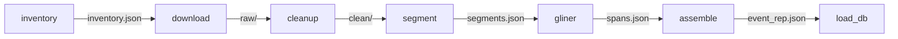
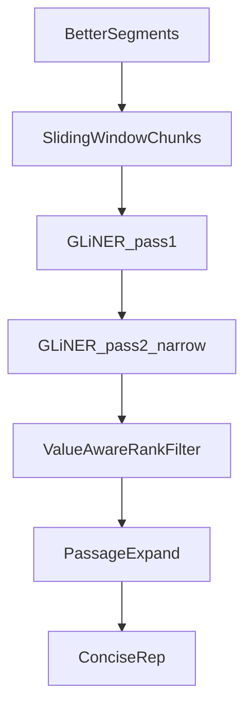
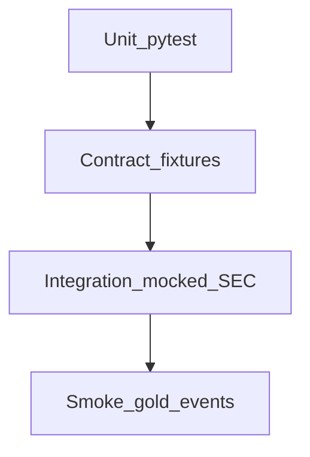

# LLD: Preprocess Pipeline (TO-first Concise Rep)

| Field | Value |
|-------|--------|
| **Document type** | Low-Level Design (LLD) |
| **Status** | Implemented (v1) + upstream NLP quality **v2** (smaller windows, role demotion, doc-role routing, always-on priority pass-2, quality gates) |
| **Scope** | Public SEC docs → path-isolated preprocess → Concise Rep → path-specific DB tables |
| **Primary path** | Tender Offer (TO); EO / Rights / Merger / Conversion stubs |
| **Out of scope** | Multi-Agent field resolution, BNY `event_field_values` curation, notification drafts, Update History UI |
| **Worked I/O example** | [`docs/preprocess-stage-io-example.md`](preprocess-stage-io-example.md) |
| **Related** | [`db/schema.sql`](../db/schema.sql), [`db/README.md`](../db/README.md), [`src/eda/`](../src/eda/) |

---

## 1. Purpose

Build a **modular, plug-and-play preprocess** that turns preferred tender-offer SEC filings into a **Concise Representation** (candidate entities + facts with evidence), loads it into **path-specific Postgres tables**, and exposes **metrics + visual QA** at every stage.

Downstream Multi-Agent / notification work consumes Concise Rep — it is **not** built in this LLD.

---

## 2. Architecture overview



### 2.1 Design principles

1. **Stages do not import each other** — only read/write versioned artifacts (+ shared `contracts` / `store`).
2. **Each stage is independently runnable** via CLI (`--stage …`).
3. **Event paths are plugins** (TO, EO, …) — same stage interfaces; orchestrator unchanged when swapping paths.
4. **NLP backends are plugins** — `SpanBackend` protocol; concrete `GlinerBackend`.
5. **Orchestrator is thin wiring only** — no business logic.
6. **Failure isolation** — per-event/per-doc status in stage manifests; batch continues.

### 2.2 Stage contract

```text
Input artifact(s)  →  Stage.run(context)  →  Output artifact(s) + stage_manifest.json
```

| Stage | Input | Output |
|-------|--------|--------|
| `inventory` | events/documents parquet | `inventory.json`, cohort lists |
| `download` | inventory | `raw/*`, download manifest |
| `cleanup` | `raw/*` | `clean/*.txt`, `clean/*.meta.json` |
| `segment` | clean + raw HTML (TOC) | `segments.json` |
| `gliner` | `segments.json` | `spans.json` |
| `assemble` | inventory + meta + segments + spans | `concise/event_rep.json` |
| `load_db` | `event_rep.json` | path-specific Concise Rep tables |

Also: `--viz` / `--viz-only` for charts + HTML inspect pages (see §9).

---

## 3. Package layout

```text
src/preprocess/
  contracts.py          # Stage protocol, SpanBackend, artifact path helpers
  store.py              # read/write artifacts only
  orchestrator.py       # stage registry; full-pipeline wiring
  viz.py                # PNG + HTML inspect generators
  metrics.py            # stage_manifest rollup → CSV
  progress.py           # shared tqdm wrapper (stage_progress)
  span_rank.py          # value-aware rank/filter + passage expand (post-GLiNER)
  stages/
    inventory.py
    download.py
    cleanup.py
    segment.py
    gliner_ie.py        # SpanBackend only
    assemble.py
    load_db.py
  backends/
    base.py
    gliner_backend.py
  paths/
    tender.py           # full TO config (docs, labels)
    exchange.py         # stub
    rights.py           # stub
    merger.py           # stub
    conversion.py       # stub
scripts/run_preprocess.py
```

**Forbidden coupling:** `download` must not call GLiNER; `gliner_ie` must not scrape TOC; path modules must not hardcode FS paths outside `store`.

**Reuse (do not reimplement):**

- [`src/eda/sec_client.py`](../src/eda/sec_client.py) — `document_url`, `filing_index`, `get_bytes`
- [`src/eda/documents.py`](../src/eda/documents.py) — `html_to_text`
- [`src/eda/mvp.py`](../src/eda/mvp.py) / [`event_taxonomy.py`](../src/eda/event_taxonomy.py) — preferred TO selection
- [`data/processed/documents.parquet`](../data/processed/documents.parquet), `events.parquet`

---

## 4. On-disk artifacts

```text
data/preprocess/
  tender/events/{event_id}/
    inventory.json
    manifest.json                 # rolling event-level status
    raw/{accession}__{file}
    clean/{accession}__{file}.txt
    clean/{accession}__{file}.meta.json
    segments.json
    spans.json
    concise/event_rep.json
  exchange/ | rights/ | merger/ | conversion/   # stub dirs
```

Large `raw/` and `clean/` trees are gitignored.

---

## 5. TO source model and cohorts

### 5.1 Document vocabulary

| Name | SEC form / exhibit | Role |
|------|--------------------|------|
| Schedule TO cover | `SC TO-T(/A)`, `SC TO-I(/A)` | Formal filing cover |
| Offer to Purchase | `EX-99.(A)(1)(A)` / description `OFFER TO PURCHASE` | Primary GLiNER input |
| Letter of Transmittal | `EX-99.(A)(1)(B)` / description | Optional |
| 14D-9 | `SC 14D9(/A)` | Target board response |
| Amendments | `*/A` on same `event_id` | New versions; do not overwrite prior raw/clean |

### 5.2 OTP discovery (priority order)

1. `file_description` contains `OFFER TO PURCHASE`
2. `file_type` in `EX-99.(A)(1)(A)`, `EX-99.A.1.A`, similar
3. `filing_index` exhibit name/type looks like OTP
4. Fallback: largest non-fee `EX-99.(A)(1)*` HTML → flag `otp_inferred`

### 5.3 Cohorts

| Cohort | Definition | Action |
|--------|------------|--------|
| **gold** | cover + OTP + 14D9 | Download first (~177 expected) |
| **needs_otp_resolve** | cover + 14D9, no OTP label | Resolve via filing_index + rules |
| **incomplete** | still no OTP | Inventory only; do not block gold |

**Download gate:** gold requires cover + OTP `status=ok` (≥95% cohort); 14D9 soft-fail with `exception_flags`.

---

## 6. NLP design — GLiNER-first (+ upstream quality upgrade)

### 6.0 Observed v1 failure modes (why we upgrade)

On gold TOs, Concise Rep is usable but noisy:

- Top spans are often **headings** (`Offer Price`, `Offer Expiration Time`) rather than **values** (`$15.00`, `October 1, 2024`).
- Parties / security collapse to boilerplate (`Parent`, `Shares`).
- Long TOC sections are truncated (GLiNER ~384 tokens; v1 also naive-cut at 3500 chars).
- FAQ segmentation under-delivers; passages are too short for the downstream agent (~100–150 chars).

**Upgrade goal:** better candidates + longer evidence **before** the LLM agent — still **no regex/gazetteer field discovery**.



### 6.1 Rules

- **All field spans** from GLiNER (or equivalent `SpanBackend`). **No regex IE discovery.**
- DOM / BeautifulSoup allowed **only for segmentation** (TOC anchors, FAQ Q/A boundaries, priority headings).
- `doc_role` from EDGAR metadata, not body keyword search.
- **Allowed after spans exist:** value-aware **ranking/filtering** of model outputs; light normalize (parse date/money string); passage expansion from segment text.
- Ranking may use shape checks **only among GLiNER candidates** (promote `$…` / calendar-like spans; demote label-like phrases). It must **not** search the filing for new spans.

### 6.2 Segmentation algorithm (upgraded)

**OTP TOC:** collect `a[name]` / `a[id]` / TOC `href="#…"` targets → ordered section spans → `kind=toc_section`.

**Priority segments:** always emit high-priority chunks when headings match **Summary Term Sheet** / **Important Dates** (DOM heading text), even if FAQ parse fails → `kind=priority_section` (or tagged `priority=true` on `toc_section`).

**OTP FAQ (hardened):** detect Q/A via:

- bold/strong text ending in `?`, **or**
- `dt`/`dd`, **or**
- two-column question/answer tables, **or**
- `p` starting with `Q:`

→ `kind=faq`.

**Boilerplate drop (segmentation only):** skip TOC-index-only, signature blocks, and fee-table sections via heading denylist.

**Fallback ladder:** priority + TOC → FAQ → `full_doc` windows.

**Cover / LoT / 14D9:** usually one `full_doc` segment (optionally coarse HTML headings).

### 6.3 Chunking for GLiNER (replace naive truncate)

In `GlinerBackend` / gliner stage:

- Split each segment into **sliding windows** (~900 chars ≈ 200–300 tokens, ~150-char overlap) so chunks fit GLiNER’s ~384-token limit.
- Run GLiNER **per window**; **remap** `start`/`end` to segment coordinates.
- Cap windows per section (default **8**, including a tail window) for cost control.
- Do **not** use a single `text[:3500]` cut as the only strategy.

### 6.4 GLiNER labels (value-oriented)

Prefer labels that bias toward values, not heading echo:

`offer_price_amount`, `expiration_datetime`, `withdrawal_datetime`, `effective_datetime`, `settlement_datetime`,  
`offeror_organization`, `target_organization`, `purchaser_organization`,  
`security_name`, `cusip_code`, `isin_code`, `ticker_symbol`, `currency_code`,  
`minimum_tender_condition`, `proration_terms`, `available_option`

Map labels → Concise Rep `field_hint` via `LABEL_TO_FIELD_HINT` (e.g. `offer_price_amount` → `offer_price`).

**Per-segment-kind label subsets:** shorter sets for cover vs Summary/FAQ to reduce junk.

Missing model → `preprocess_status=failed`, `gliner_unavailable` — **no regex fallback**.

### 6.5 Two-pass GLiNER

1. **Pass 1:** full (or kind-specific) label set on each chunk.  
2. **Pass 2 (always on priority):** re-run **priority_section** + **faq** segments with narrow labels (`money_amount`, `calendar_date`, `org_name`), even when pass-1 already found some values.  
3. **Pass 2 (conditional):** if a family (price / date / org) has **only label-like / agent / shell** spans, also re-run OTP `toc_section` chunks with the narrow set.  
4. Merge; still `method=gliner` only.

### 6.6 Value-aware span ranker + passage expand

Module: `src/preprocess/span_rank.py` (called from gliner end or assemble):

| Step | Behavior |
|------|----------|
| Demote | Text ≈ label / known headings (`Offer Price`, `Parent`, `Shares`, `Effective Time`, …) |
| Demote parties | Depositary / information / exchange / paying agent / trustee orgs (e.g. Computershare, MacKenzie) for `offeror`/`purchaser`/`target`; shell names (`Merger Sub`, `Parent`) when a legal-name span exists |
| Promote | Among GLiNER outputs, prefer money-/date-/CUSIP-shaped strings; prefer legal names with Inc/Corp/Ltd/LLC |
| Doc-role routing | Soft bonus: **cover** for `cusip`/`ticker`/`target`/`security_description`; **OTP** (+ FAQ/priority) for `offer_price`/`expiration_date` |
| NMS | Near-duplicate strings per label → keep top-K by `rank_score` |
| Expand | Passage = sentence or ±400 chars from segment (median target ≥ ~300 chars) |
| Emit | Keep model `score` **and** `rank_score`; sort Concise Rep facts by `rank_score` |

### 6.7 Concise Rep (assemble output)

`schema_version`, `event_id`, `cohort`, `preprocess_status`, `nlp_versions`,  
`doc_inventory[]`, `entities[]`, `candidate_facts[]` (`method` must be `gliner`),  
`exception_flags[]`.

Each fact/entity should carry: `confidence` (model score), `rank_score` (adjusted), expanded `passage`, `section` / `faq_question`, `chunk_id` when applicable.

Canonical shapes: [`preprocess-stage-io-example.md`](preprocess-stage-io-example.md).  
SEC-only notification contract for the downstream agent: [`schema.md`](schema.md).

### 6.8 Upstream quality gates (gold events)

Module: `src/preprocess/quality_gates.py` — run on Concise Rep (unit-tested; gold re-check on `005-02933`, `005-06295`):

- Top-1 `offer_price` candidate is a `$` amount (not a heading).
- Top-1 `expiration_date` contains a calendar date string.
- Top-1 `offeror` is **not** an agent/shell (`Computershare`, `MacKenzie`, `Merger Sub`, …).
- Top-1 `security_description` not alone in boilerplate denylist (`Shares`, …).
- Passage length median ≥ ~300 characters.
- Still **zero** `method=regex` facts.

### 6.9 Deferred (only if 6.2–6.6 insufficient)

- Default gold runs to `gliner_large-v2.1`.
- Lightweight coreference beyond shell/agent demotion.
- Do **not** add spaCy EntityRuler / regex IE as primary extractor.

---

## 7. Database design — Concise Rep (path-isolated)

Concise Rep sits **between** disk artifacts and future `event_field_values`.

Existing catalog stays: `events`, `documents`, `event_versions`, `schema_fields`, `event_field_values`.

### 7.1 Table families (one set per path)

For each of `tender`, `exchange`, `rights`, `merger`, `conversion`:

| Table | Purpose |
|-------|---------|
| `{path}_concise_reps` | Header: event, optional version, model, status, flags |
| `{path}_concise_docs` | Docs that fed the rep |
| `{path}_concise_segments` | TOC / FAQ / full_doc chunks (optional persistence) |
| `{path}_concise_entities` | GLiNER entity spans |
| `{path}_concise_facts` | Candidate facts + evidence |

Stubs write header-only rows with `preprocess_status='stub_not_implemented'`.

### 7.2 Tender DDL (canonical; other paths mirror)

```sql
CREATE TABLE tender_concise_reps (
    concise_rep_id    BIGSERIAL PRIMARY KEY,
    event_id          TEXT NOT NULL REFERENCES events (event_id) ON DELETE CASCADE,
    version_id        BIGINT REFERENCES event_versions (version_id) ON DELETE SET NULL,
    schema_version    TEXT NOT NULL DEFAULT '1',
    pipeline          TEXT NOT NULL DEFAULT 'to_preprocess_gliner',
    gliner_model      TEXT,
    preprocess_status TEXT NOT NULL,
    exception_flags   TEXT[],
    cohort            TEXT,
    artifact_path     TEXT,
    nlp_versions      JSONB NOT NULL DEFAULT '{}'::jsonb,
    payload_json      JSONB,              -- optional full event_rep for replay
    created_at        TIMESTAMPTZ NOT NULL DEFAULT NOW(),
    UNIQUE (event_id, version_id, schema_version)
);

CREATE TABLE tender_concise_facts (
    fact_id           BIGSERIAL PRIMARY KEY,
    concise_rep_id    BIGINT NOT NULL REFERENCES tender_concise_reps (concise_rep_id) ON DELETE CASCADE,
    field_hint        TEXT NOT NULL,
    raw_text          TEXT NOT NULL,
    passage           TEXT,
    method            TEXT NOT NULL CHECK (method = 'gliner'),
    confidence        REAL,              -- model score
    rank_score        REAL,              -- value-aware adjusted score
    doc_role          TEXT,
    source_hit_id     TEXT REFERENCES documents (hit_id) ON DELETE SET NULL,
    source_accession  TEXT,
    section           TEXT,
    faq_question      TEXT,
    char_start        INTEGER,
    char_end          INTEGER,
    label             TEXT,
    chunk_id          TEXT
);
```

(`tender_concise_docs`, `_segments`, `_entities` follow the same FK pattern.)

### 7.3 Grain (locked default)

**Per `event_versions` row when available** (version-grain); otherwise one rep per `event_id` with `version_id NULL`. Supports amendment history later without schema rewrite.

### 7.4 Handoff

Multi-Agent (future) reads `{path}_concise_facts` → writes shared `event_field_values`.

---

## 8. Metrics (flow gates)

Every stage writes counts into `stage_manifest.json`. Roll up: `outputs/to_preprocess_metrics.csv`.

**Funnel:** cohort events → docs selected → raw ok → clean ok → segments > 0 → spans > 0 → facts > 0 → DB rows.

| Stage | Must-track metrics | Gate |
|-------|--------------------|------|
| inventory | cohort sizes; `%has_cover/otp/14d9/lot`; OTP method mix | Preferred count in band; gold share stable |
| download | ok / skip / http_error / empty; gold cover+OTP % | Gold cover+OTP ≥ 95% |
| cleanup | empty text; words by role | Empty OTP clean → fail |
| segment | `%TOC`, `%FAQ`, fallback rate | Zero segments on gold OTP → fail |
| gliner | spans/label; `%offer_price` / party; unavailable count; `%top1_price_is_money`; passage length p50 | No regex; gold top-1 price/date gates (§6.8) |
| assemble | facts/entities; `%method=gliner` | Must be 100% gliner |
| load_db | upsert counts; FK errors | Counts match JSON; no orphans |

**Continuity:** `events_stage_N ⊆ events_ok_stage_{N-1}`; artifact presence chain; per-event `pipeline_status` timeline.

Run header: `run_id`, `path`, `stage`, `cohort`, timestamps, success/fail/skip, top errors.

---

## 9. Visualizations (visual QA)

Module: `src/preprocess/viz.py` (style aligned with [`src/eda/mvp_viz.py`](../src/eda/mvp_viz.py)).

```text
figures/preprocess/                    # PNGs
outputs/preprocess_inspect/{event_id}/ # HTML (gitignored if large)
  01_inventory.html … 07_db_load.html
```

| Stage | PNG | HTML inspect |
|-------|-----|--------------|
| inventory | cohort / source coverage / OTP method | selected docs table |
| download | status by role; bytes hist | per-doc status / path / sha1 |
| cleanup | words by role | clean-text preview |
| segment | TOC/FAQ rates; section counts | **segment gallery** |
| gliner | label bars; score hist | **span highlight** page |
| assemble | facts by field_hint | Concise Rep facts table |
| load_db | row counts | upsert preview vs disk |

**Cross-stage:** `preprocess_selection_funnel.png`, artifact-presence heatmap, label-coverage heatmap.

CLI: `--viz`, `--viz-only`, `--inspect-limit 5`. Static PNG+HTML only (no Streamlit in v1).

---

## 9.1 Progress tracking (tqdm)

Every stage wraps its primary loop in **tqdm** for live terminal progress on long gold runs.

| Stage | Bar advances over | Postfix (examples) |
|-------|-------------------|----------------------|
| inventory | events | running cohort counts |
| download | docs | ok / skip / err |
| cleanup | docs | empty-text count |
| segment | events or docs | toc / faq found |
| gliner | segments | spans emitted |
| assemble | events | facts / entities |
| load_db | events | rows upserted |
| viz | events | pages written |

**Rules:**

- Shared helper `src/preprocess/progress.py` → `stage_progress(...)` around `tqdm.tqdm`.
- Default on for interactive CLI; `--no-progress` or `PREPROCESS_NO_PROGRESS=1` disables.
- Auto-disable when stdout/stderr is not a TTY (CI); `--progress` forces on.
- Prefer **one bar per stage** (avoid noisy nested bars).
- tqdm → stderr; manifests/metrics CSV remain the source of truth.
- Dependency: `tqdm`.

---

## 10. CLI

```bash
python scripts/run_preprocess.py --path tender --stage inventory
python scripts/run_preprocess.py --path tender --stage download --cohort gold --limit 10
python scripts/run_preprocess.py --path tender --stage cleanup --event-id 005-88347
python scripts/run_preprocess.py --path tender --stage segment --event-id 005-88347
python scripts/run_preprocess.py --path tender --stage gliner --event-id 005-88347
python scripts/run_preprocess.py --path tender --stage assemble --event-id 005-88347
python scripts/run_preprocess.py --path tender --stage load_db --event-id 005-88347
python scripts/run_preprocess.py --path tender --stage all --cohort gold --limit 3 --viz
python scripts/run_preprocess.py --path tender --viz-only --event-id 005-88347
python scripts/run_preprocess.py --path tender --stage all --no-progress   # CI / logs
python scripts/run_preprocess.py --path exchange   # stub
```

---

## 11. Testing strategy



| Layer | Coverage |
|-------|----------|
| Unit | cohorts, doc_role, wrapper strip, TOC/FAQ fixtures, Concise Rep schema, stubs |
| Download | mocked SecClient; idempotency; failure isolation; optional `@network` |
| GLiNER | unavailable → fail clean; mocked spans; `@pytest.mark.gliner` for real weights |
| Coverage | inventory band + `to_source_coverage.csv` summary |
| Smoke | 3 gold events: raw/clean/segments/gliner facts/DB; stubs no-op |

Fixtures: `tests/fixtures/tender/` (clipped HTML). CI: unit + mocked download; exclude `@network` / `@gliner` by default.

**Not tested here:** BNY field F1 vs human GT; full gold download in CI.

---

## 12. Stubs (non-TO paths)

Each path plugin:

- Same stage interfaces / registry entry  
- Declares forms from `event_taxonomy.py`  
- Writes `preprocess_status=stub_not_implemented`  
- No network downloads  

---

## 13. Acceptance criteria (TO v1 + NLP quality)

- [x] Preferred gold events produce raw + clean + segments + spans + `event_rep.json`
- [x] Candidate facts use `method=gliner` only
- [x] Concise Rep loaded into `tender_concise_*` tables
- [x] Re-run download is idempotent (`skipped` when sha1 matches)
- [x] Missing GLiNER → `gliner_unavailable` (no regex fallback)
- [x] Stage metrics CSV + funnel PNG + inspect HTML for sample events
- [x] Stub paths no-op without network
- [ ] Sliding-window chunking (no sole `text[:3500]` path)
- [ ] Value-aware `rank_score`; top-1 price/date pass §6.8 gates on gold events
- [ ] Expanded passages (median ≥ ~300 chars)
- [ ] Priority Summary Term Sheet / hardened FAQ segments when present in OTP

---

## 14. Implementation work items

**Done (v1 scaffold):** items 1–11 below were delivered for the initial TO preprocess.

1. Scaffold `src/preprocess` contracts, store, orchestrator, path stubs  
2. Independent CLI per stage + `all`  
3. TO inventory + cohorts + OTP discovery  
4. Download (gold then resolve) + coverage CSV  
5. Cleanup + segment (DOM TOC/FAQ)  
6. GLiNER backend + assemble Concise Rep  
7. Schema SQL for five path table families + `load_db`  
8. Metrics rollup + viz PNG/HTML  
9. tqdm progress on all stage loops (`progress.py`, `--no-progress`)  
10. Pytest suite + smoke on ~3–5 gold events  
11. README / `db/README` notes linking this LLD  

**Upstream NLP quality (§6.0–6.8) — done (v2):**

12. Sliding-window GLiNER (~900 chars, max 8) + offset remap  
13. `span_rank.py` (label/agent/shell demotion, value promote, doc-role bonus, NMS, passage expand)  
14. Value-oriented labels + Summary Term Sheet priority + FAQ hardening  
15. Always-on narrow pass-2 on priority/FAQ (+ conditional weak-family)  
16. `quality_gates.py` + pytest; gold re-check `005-02933` / `005-06295`  
17. Residual weak `target`/`security_description` when GLiNER mislabels → agent / optional `gliner_large`  

---

## 15. Explicit non-goals (later)

- Multi-Agent conflict resolution and curated `event_field_values` (see [`schema.md`](schema.md) for SEC-only agent contract)  
- Notification draft generation  
- Amendment Update History product UI  
- Production EO / Rights / Merger / Conversion NLP (beyond stubs)  
- Interactive Streamlit/Gradio dashboards  
- Regex / spaCy EntityRuler as primary field IE  
